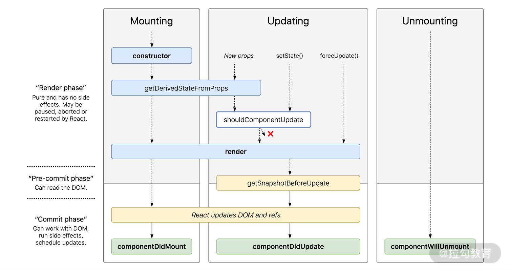

### build a tiny react by youself
### react lifestyle hook
- componentWillMount
- componentDidMount
- componentWillReceiveProps
- shouldComponentUpdate
- componentDidUpdate
- componentWillUnMount

### 挂载过程
componentWillMount
render
componentDidMount

### 组件更新阶段
## 父组件更新

componentWillReceiveProps
父组件更新，无论是state还是props，都会触发子组件的 componentWillReceiveProps 执行
shouldComponentUpdate
返回true，重新re-render
componentWillUpdate
render
componentDidUpdate

## 子组件更新
shouldComponentUpdate
componentWillUpdate
render
componentDidUpdate

### 组件销毁阶段
componentWillMount

### React 16.3之后的更新过程

### fiber 过程
在mount时：通过JSX创建FiberRoot和RootFiber
FiberRoot.current = RootFiber
在update时：会根据新的状态形成的JSX和current Fiber对比形成一颗叫做 WorkingInProgress 的Fiber树，然后将FiberRoot的current指向WorkingInProgress，此时workingInProgress就变成了current Fiber FiberRoot只存在一个