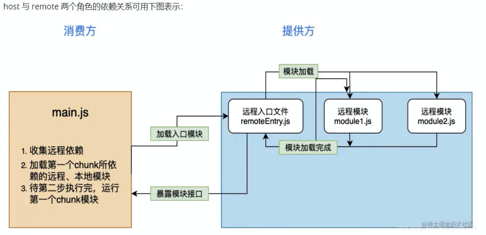

## 模块联邦 Module Federation
模块联邦（module federation）是webpack5中的一项功能，可以实现跨应用共享模块

- 使用模块联邦，每一个应用都是一个单独的构建，每个应用都会被构建成容器
- 容器是去中心化的，容器可以加载其他应用，也可以被其他应用使用
- 一个被引用的容器称为 remote，引用者被称为 host，remote暴露模块给host，host则可以使用这些模块，这些模块被称为remote模块

#### 依赖关联

总结：一个webpack构建的项目可以是remote，即模块的提供方生产者，也可以是host，即服务的消费方，也可以同时扮演生产者消费者，完全看项目的架构